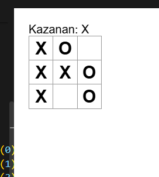

# 🎯 TicTacToe Oyunu

Basit bir React.js projesi olarak geliştirilen bu oyun, klasik X-O oyununu tarayıcı üzerinden oynamanıza imkân tanır.

## 🚀 Özellikler
- Kullanıcı dostu arayüz
- React bileşen yapısı
- Anlık oyun durumu güncellemesi

## 📁 Proje Yapısı
📁 src/
📁 public/
📄 package.json

bash
Kodu kopyala

## ⚙️ Kurulum
```bash
git clone https://github.com/kullaniciadi/tictactoe.git
cd tictactoe
npm install
npm start
```
## 🖼️ Ekran Görüntüsü

## 🛠️ Kullanılan Teknolojiler
React.js

HTML/CSS

JavaScript
